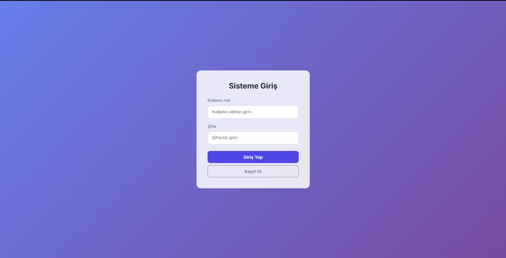
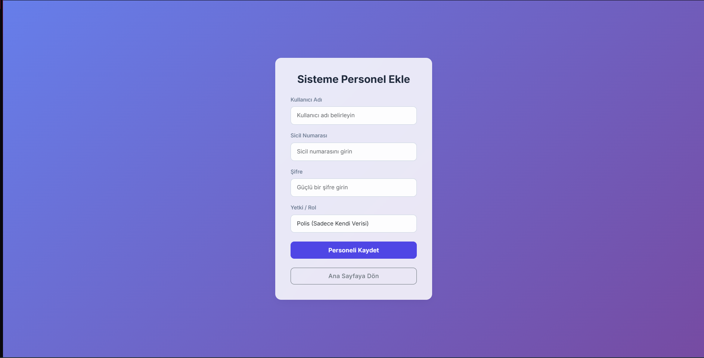
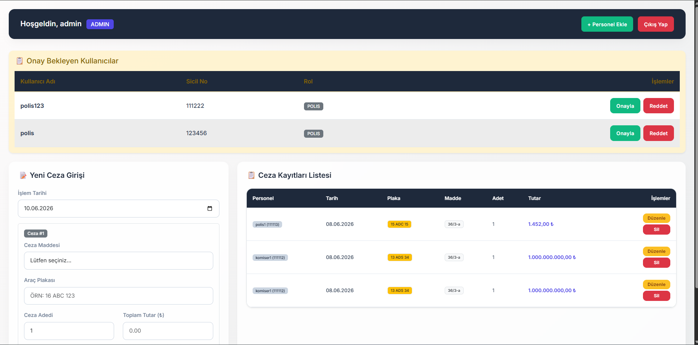
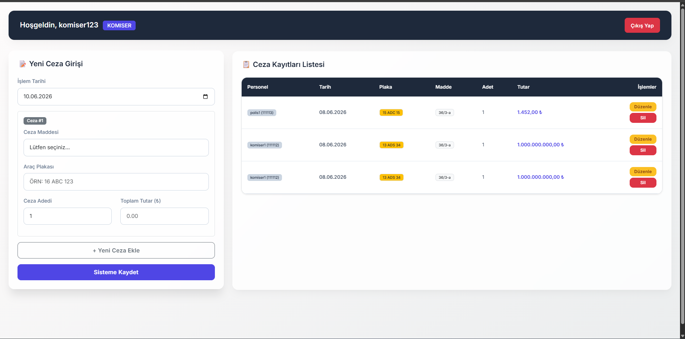
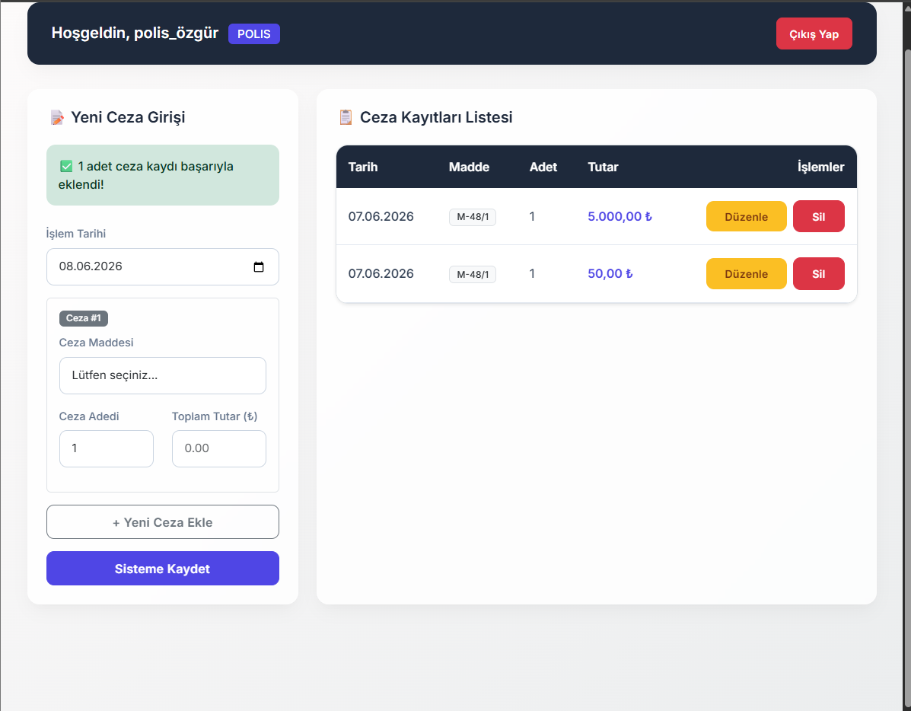
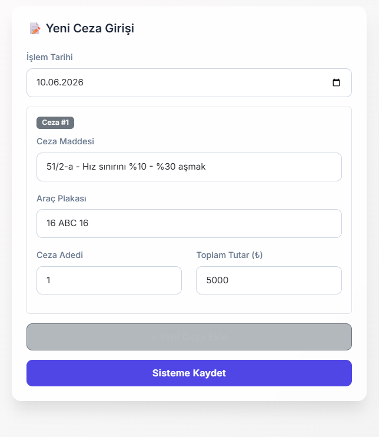

# 🚦Web Tabanlı Programlama Dersi — Dönem Projesi / Trafik Cezası Kayıt Otomasyon Sistemi
 
> Bursa Teknik Üniversitesi | 2025-2026 Bahar Dönemi

PHP, MySQL, Bootstrap 5 ve saf (vanilla) JavaScript kullanılarak geliştirilmiş, rol tabanlı erişim kontrolüne sahip kapsamlı bir trafik cezası kayıt ve yönetim sistemi.

---

## 📑 İçindekiler

1. [Proje Hakkında](#-proje-hakkında)
2. [Ekip ve İş Bölümü](#-ekip-ve-iş-bölümü)
3. [Özellikler](#-özellikler)
4. [Kullanıcı Rolleri](#-kullanıcı-rolleri)
5. [Kullanılan Teknolojiler](#️-kullanılan-teknolojiler)
6. [Dosya Yapısı](#-dosya-yapısı)
7. [Veritabanı Şeması](#️-veritabanı-şeması)
8. [Ekran Görüntüleri](#️-ekran-görüntüleri)
9. [Tanıtım Videosu](#-tanıtım-videosu)

---

### 📖 Proje Hakkında

Uygulamamız, trafik polislerinin ceza kayıtlarını dijital ortamda tutmasına ve üst düzey yetkililerin tüm kayıtlara erişerek yönetmesine olanak tanır.

**Proje Amacı:** Ceza kayıt süreçlerini dijital ortama taşıyarak; veri karmaşasını ve veri kaybını önlemek, iş yükünü azaltmak ve yetkili personelin anlık raporlamaya erişimini sağlamak.

**Kapsam:** Projemiz; kullanıcı kaydı, şifreli giriş, CRUD (Oluştur / Oku / Güncelle / Sil) işlemleri ve rol tabanlı yetkilendirme gibi temel web uygulama özelliklerine sahiptir.

---

### 👥 Ekip ve İş Bölümü

| Öğrenci | Numara | Görevler |
|---|---|---|
| **Bedirhan Gök** | 23360859046 | Veritabanı tasarımı ve SQL şeması oluşturma · `baglanti.php` bağlantı katmanı · `kayit.php` kullanıcı kayıt modülü · `login.php` kimlik doğrulama sistemi · `cikis.php` oturum kapatma · Rol tabanlı yetkilendirme mimarisi · Güvenlik açığı tespiti ve `sil.php` SQL Injection düzeltmesi |
| **Özgür Kotbaş** | 23360859011 | `index.php` ana dashboard (CREATE + READ) · `duzenle.php` kayıt güncelleme modülü · `style.css` Glassmorphism arayüz tasarımı · JavaScript ile dinamik form satırları · `kullanici_islem.php` admin onay mekanizması · Bootstrap 5 entegrasyonu ve responsive düzen · `duzenle.php` SQL Injection düzeltmesi ve `index.php` listeleme güvenlik iyileştirmesi |

---

### ✨ Özellikler

| Özellik | Açıklama |
|---|---|
| 👤 Kullanıcı Kaydı | `password_hash()` ile bcrypt hashlenmiş şifre, sicil no ile kayıt |
| 🔐 Oturum Açma / Kapama | PHP Sessions ile güvenli oturum yönetimi, session fixation koruması |
| ➕ Ceza Kaydı Oluşturma | Tek seferde birden fazla ceza satırı eklenebilir, araç plakası kaydı |
| 📋 Kayıt Listeleme | Rol'e göre filtrelenmiş liste görünümü (polis: kendi, komiser/admin: tümü) |
| ✏️ Kayıt Düzenleme | Tarih, adet ve tutar güncellenebilir |
| 🗑️ Kayıt Silme | Onay diyaloğu ile güvenli silme |
| 🛡️ Rol Tabanlı Yetki | Polis → kendi kayıtları · Komiser → tüm kayıtlar · Admin → tam yönetim |
| 📝 Manuel Madde Girişi | Listede olmayan ceza maddelerini sistemde olmadığında elle girebilme |
| ✅ Kullanıcı Onay Mekanizması | Admin, yeni kayıt olan kullanıcıları onaylayabilir veya reddedebilir |

---

### 🔑 Kullanıcı Rolleri

Sistemde üç farklı kullanıcı rolü bulunmaktadır:

#### 👮 Polis
- Sisteme yeni trafik cezası kaydı girebilir
- Sadece kendi girdiği kayıtları görüntüleyebilir
- Kendi ceza kayıtlarını düzenleyebilir veya silebilir

#### 🪖 Komiser
- Tüm ceza kayıtlarını listeleyebilir
- Her kaydı düzenleyebilir ve silebilir
- Herhangi bir ceza kayıt girişi yapabilir

#### 🔧 Admin
- Komiser yetkilerine ek olarak kullanıcı yönetimi yapabilir
- Sisteme yeni kayıt olan kullanıcıları onaylayabilir veya reddedebilir
- Onay bekleyen kullanıcıları dashboard üzerinden görüntüleyebilir

---

### 🛠️ Kullanılan Teknolojiler

| Katman | Teknoloji |
|---|---|
| **Backend** | Saf PHP |
| **Veritabanı** | MySQL / MariaDB — MySQLi + Prepared Statements |
| **Frontend** | HTML5, Bootstrap 5.3 (CDN), Vanilla JavaScript |
| **Stil** | Özel CSS — Glassmorphism tasarım dili, Google Inter fontu |
| **Güvenlik** | `password_hash`, `session_start`, `htmlspecialchars`, Prepared Statements |

---

### 📁 Dosya Yapısı

```
Trafik-Cezasi-Kayit-Otomasyon-Sistemi/
│
├── images/               # Projeye ait görsel dosyaları
├── baglanti.php          # Veritabanı bağlantı yapılandırması
├── index.php             # Ana dashboard (CREATE + READ işlemleri)
├── login.php             # Kullanıcı giriş sayfası
├── kayit.php             # Yeni kullanıcı kayıt sayfası
├── duzenle.php           # Kayıt düzenleme (UPDATE)
├── sil.php               # Kayıt silme (DELETE)
├── cikis.php             # Oturum sonlandırma (logout)
├── kullanici_islem.php   # Admin: kullanıcı onaylama / reddetme
├── veritabani_duzelt.php # Veritabanı şema düzeltme yardımcısı
├── style.css             # Özel CSS stilleri (Glassmorphism)
├── README.md             # Bu dosya — proje dokümantasyonu
```

### Dosya Açıklamaları

| Dosya | Tür | Açıklama |
|---|---|---|
| `baglanti.php` | PHP | Veritabanı bağlantı parametrelerini tutar. Kurulumda düzenlenmesi gereken tek dosya. |
| `index.php` | PHP + HTML | Giriş sonrası açılan ana sayfa. Ceza giriş formu ve kayıt listesini barındırır. |
| `login.php` | PHP + HTML | Kullanıcı adı/şifre ile giriş ekranı. |
| `kayit.php` | PHP + HTML | Yeni personel hesabı oluşturma formu. |
| `duzenle.php` | PHP + HTML | Seçilen ceza kaydının güncellenmesi için form. |
| `sil.php` | PHP | URL parametresiyle gelen kayıt ID'sini doğrulayarak siler. |
| `cikis.php` | PHP | Session'ı sonlandırıp login sayfasına yönlendirir. |
| `kullanici_islem.php` | PHP | Admin onaylama/reddetme işlemlerini gerçekleştirir. |
| `style.css` | CSS | Glassmorphism efektleri, renk değişkenleri ve özel bileşen stilleri. |
| `images/` | Klasör | Projeye ait görsel dosyaları
---

### 🗄️ Veritabanı Şeması

Sistem üç ana tablodan oluşmaktadır:

```
kullanicilar
├── id              INT (PK, AUTO_INCREMENT)
├── kullanici_adi   VARCHAR(50) UNIQUE NOT NULL
├── sicil_no        VARCHAR(20)
├── sifre           VARCHAR(255)  ← bcrypt hash
├── rol             ENUM('polis', 'komiser', 'admin')
├── is_approved     TINYINT(1) DEFAULT 0
└── olusturma_tar   TIMESTAMP DEFAULT CURRENT_TIMESTAMP

ceza_maddeleri
├── id          INT (PK, AUTO_INCREMENT)
├── madde_no    VARCHAR(20) UNIQUE  ← Örn: M-51/1, 47/1-B
├── aciklama    TEXT
└── tutar       DECIMAL(10,2)

ceza_kayitlari
├── id              INT (PK, AUTO_INCREMENT)
├── kullanici_id    INT (FK → kullanicilar.id)
├── tarih           DATE
├── madde_id        INT (FK → ceza_maddeleri.id)
├── plaka           VARCHAR(20)
├── adet            INT
├── toplam_tutar    DECIMAL(10,2)
└── kayit_tar       TIMESTAMP DEFAULT CURRENT_TIMESTAMP
```

**İlişki Diyagramı:**

```
kullanicilar (1) ──────< ceza_kayitlari >────── (1) ceza_maddeleri
```

---

### 🖼️ Ekran Görüntüleri

**Giriş Sayfası**



**Giriş Sayfası**



**Admin Panel**


**Komiser Panel**


**Polis Panel**


**Ceza Giriş Formu**



---

### 🎬 Tanıtım Videosu

📹 [YouTube Linki](https://www.youtube.com/watch?v=uWXfkNyfpaE&t=541s)

---

<div align="center">

**Bursa Teknik Üniversitesi — Web Tabanlı Programlama Dersi**

Hazırlayanlar: **Bedirhan Gök** (23360859046) & **Özgür Kotbaş** (23360859011)

</div>
